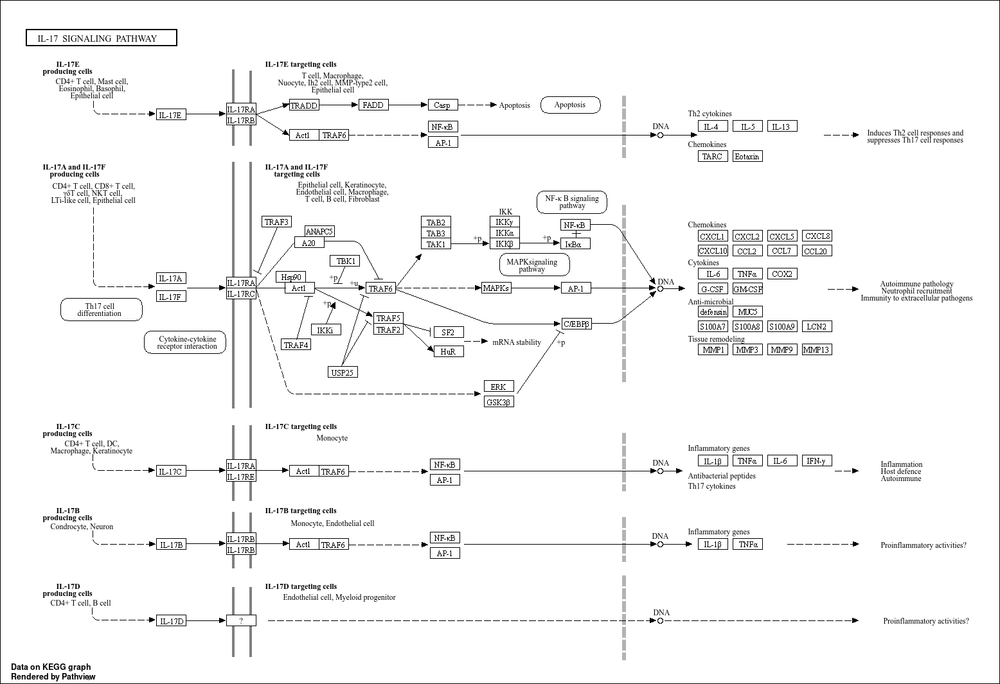

For our school project were are gone do an research like 
(Fibroblast-derived osteoglycin promotes epithelial cell repair)[https://pmc.ncbi.nlm.nih.gov/articles/PMC11937367/].
They are very specific and we are gone a look more global. I will look at the pathway analysis of the transcription.

For this i will use fgsea that is an tool that can be used for this kind of analysis.


First we are going to install it. That do we as follow:
```{r, message=FALSE, warning=FALSE}
if (!require("BiocManager", quietly = TRUE))
    install.packages("BiocManager")

BiocManager::install("fgsea")
```

```{r, , message=FALSE, warning=FALSE}
if (!requireNamespace("BiocManager", quietly = TRUE))
    install.packages("BiocManager")
BiocManager::install("org.Mm.eg.db")

```

After this we read the library in:
```{r,message=FALSE, warning=FALSE}
library(fgsea)
library(pathview)
library(data.table)
library(ggplot2)
library(DESeq2)
library(clusterProfiler)
library(msigdbr)
library(dplyr)
library(ggfortify)
library(org.Mm.eg.db)
```


After this i am going to use the example data to look how it all works. 

# oefen

```{r}
data(examplePathways)
data(exampleRanks)
```

```{r}
fgseaRes <- fgsea(pathways = examplePathways, 
                  stats    = exampleRanks,
                  minSize  = 15,
                  maxSize  = 500)
as.data.frame(fgseaRes)
```

```{r, message=FALSE, warning=FALSE}
fgseaRes <- fgsea(pathways = examplePathways, 
                  stats    = exampleRanks,
                  eps      = 0.0,
                  minSize  = 15,
                  maxSize  = 500)

head(as.data.frame(fgseaRes[order(pval), ]))
```


```{r, message=FALSE, warning=FALSE}
plotEnrichment(examplePathways[["5990980_Cell_Cycle"]],
               exampleRanks) + labs(title="Programmed Cell Death")

```
```{r, message=FALSE, warning=FALSE}
topPathwaysUp <- fgseaRes[ES > 0][head(order(pval), n=1), pathway]
topPathwaysDown <- fgseaRes[ES < 0][head(order(pval), n=1), pathway]
topPathways <- c(topPathwaysUp, rev(topPathwaysDown))
plotGseaTable(examplePathways[topPathways], exampleRanks, fgseaRes, 
              gseaParam=0.5)
```
## Over-Representation Analysis

```{r, message=FALSE, warning=FALSE}
data("gcSample") # data for examples

```

```{r, message=FALSE, warning=FALSE}
# Need to remove duplicates for the examples
all_genes <- unlist(gcSample)
universe <- all_genes[Biobase::isUnique(all_genes)] # all unique genes

# List with only unique genes
gcUnique <- lapply(gcSample, function(group_i) {
  group_i[group_i %in% universe]
})
```


```{r, message=FALSE, warning=FALSE}
# MSigDB R package)
msigdbr::msigdbr_collections() # available collections
# Subset to Human GO-BP sets
BP_db <- msigdbr(species = "Homo sapiens", 
                 category = "C5", subcategory = "GO:BP")
head(BP_db)
```

```{r, message=FALSE, warning=FALSE}
# Convert to a list of gene sets
BP_conv <- unique(BP_db[, c("entrez_gene", "gs_exact_source")])
BP_list <- split(x = BP_conv$entrez_gene, f = BP_conv$gs_exact_source)
# First ~6 IDs of first 3 terms
lapply(head(BP_list, 3), head)
```

```{r, message=FALSE, warning=FALSE}
## Cluster GO-BP ORA with fgsea package
# For each cluster i, perform ORA
fgsea_ora <- lapply(seq_along(gcUnique), function(i) {
  fora(pathways = BP_list, 
       genes = gcUnique[[i]], # genes in cluster i
       universe = universe, # all genes
       minSize = 15, 
       maxSize = 500) %>% 
    mutate(cluster = names(gcUnique)[i]) # add cluster column
}) %>% 
  data.table::rbindlist() %>% # combine tables
  filter(padj < 0.05) %>% 
  arrange(cluster, padj) %>% 
  # Add additional columns from BP_db
  left_join(distinct(BP_db, gs_subcat, gs_exact_source, 
                     gs_name, gs_description),
            by = c("pathway" = "gs_exact_source")) %>% 
  # Reformat descriptions
  mutate(gs_name = sub("^GOBP_", "", gs_name),
         gs_name = gsub("_", " ", gs_name))

# First 6 rows
head(fgsea_ora)
```

```{r, message=FALSE, warning=FALSE}
if(!require(devtools)) install.packages("devtools")
devtools::install_github("sinhrks/ggfortify")

```


```{r, message=FALSE, warning=FALSE}
data <- read.csv("../data/GSE271272_rawcounts.csv", row.names = 1)
head(data)
```


```{r, message=FALSE, warning=FALSE}
t_data = t(data)
```

```{r, message=FALSE, warning=FALSE}
log_data <- log2(t_data +1)
data_scaled <- scale(log_data)
```

```{r, message=FALSE, warning=FALSE}
pca_result <- prcomp(data_scaled, scale. = T)

```


```{r, message=FALSE, warning=FALSE}
# Splits sample naam in onderdelen
metadata <- data.frame(
  sample = rownames(t_data),
  groep = sapply(strsplit(rownames(t_data), "_"), `[`, 2),
  celtype = sapply(strsplit(rownames(t_data), "_"), `[`, 3)
)


rownames(metadata) <- metadata$sample
metadata$groep_celtype <- paste(metadata$groep, metadata$celtype, sep = "_")
```

```{r, message=FALSE, warning=FALSE}
autoplot(pca_result,
         data = metadata,
         colour= 'groep',
         x=1,
         y=2
         )+
  ggtitle("celtype")+
  theme_minimal()
```
# Pathway analuse
Nu ga ik bezig met de path way analyse met de deseq2 die ik van Mirte heb gekregen 


```{r, message=FALSE, warning=FALSE}
rna_seq_data <- read.csv(
  "../data/GSE271272_rawcounts.csv")

head(rna_seq_data)
```
```{r, message=FALSE, warning=FALSE}
cts <- data.frame(rna_seq_data[,-1])
colnames(cts) <- colnames(rna_seq_data)[-1]
row.names(cts) <- rna_seq_data$Sample
cts <- as.matrix(cts)
```

```{r, message=FALSE, warning=FALSE}
sample_names <- c("M1_ctrl_Epcam", "M2_ctrl_Epcam", "M3_ctrl_Epcam", "M4_ctrl_Epcam",
            "M1_EVs_Epcam", "M2_EVs_Epcam", "M3_EVs_Epcam", "M4_EVs_Epcam",
            "M1_SFs_Epcam", "M2_SFs_Epcam", "M3_SFs_Epcam", "M4_SFs_Epcam",
            "M1_OGN_Epcam", "M2_OGN_Epcam", "M3_OGN_Epcam", "M4_OGN_Epcam",
            "M1_ctrl_CCL", "M2_ctrl_CCL", "M3_ctrl_CCL", "M4_ctrl_CCL",
            "M1_EVs_CCL", "M2_EVs_CCL", "M3_EVs_CCL", "M4_EVs_CCL",
            "M1_SFs_CCL", "M2_SFs_CCL", "M3_SFs_CCL", "M4_SFs_CCL",
            "M1_OGN_CCL", "M2_OGN_CCL", "M3_OGN_CCL", "M4_OGN_CCL")

group <- rep(c("control", "extracellular_vesicles", "soluble_factors", "osteoglycin"), each = 4, times = 2)
type <- rep(c("epcam", "ccl"), each = 16)

metadata <- data.frame(group = factor(group), type = type)
rownames(metadata) <- sample_names

head(metadata)
```

```{r, message=FALSE, warning=FALSE}
dds <- DESeqDataSetFromMatrix(countData = cts,
                              colData = metadata,
                              design = ~ group)
```


```{r, message=FALSE, warning=FALSE}
dds <- DESeq(dds)
control_vs_extracellular <- results(dds, contrast = c("group", "control", "extracellular_vesicles"))
control_vs_soluble <- results(dds, contrast = c("group", "control", "soluble_factors"))
extracellular_vs_soluble <- results(dds, contrast = c("group", "extracellular_vesicles", "soluble_factors"))
```

Na dat alles kan ik verder. 

```{r, message=FALSE, warning=FALSE}
gene_ranks_crl_extra <- control_vs_extracellular$stat
names(gene_ranks_crl_extra) <- rownames(control_vs_extracellular)
gene_ranks_crl_extra <- sort(gene_ranks_crl_extra, decreasing = TRUE)
```

```{r, message=FALSE, warning=FALSE}
gene_ranks_crl_sol <- control_vs_soluble$stat
names(gene_ranks_crl_sol) <- rownames(control_vs_soluble)
gene_ranks_crl_sol <- sort(gene_ranks_crl_sol, decreasing = TRUE)
```

```{r, message=FALSE, warning=FALSE}
gene_ranks_extra_sol <- extracellular_vs_soluble$stat
names(gene_ranks_extra_sol) <- rownames(extracellular_vs_soluble)
gene_ranks_extra_sol <- sort(gene_ranks_extra_sol, decreasing = TRUE)
```


```{r, message=FALSE, warning=FALSE}
df_genes <- data.frame(
  symbol = names(gene_ranks_crl_extra),
  stat = gene_ranks_crl_extra
)
df_mapped <- df_genes %>%
  left_join(
    AnnotationDbi::select(org.Mm.eg.db,
                          keys = df_genes$symbol,
                          columns = c("ENTREZID", "SYMBOL"),
                          keytype = "SYMBOL"),
    by = c("symbol" = "SYMBOL")
  ) %>%
  filter(!is.na(ENTREZID))


geneList <- df_mapped$stat
names(geneList) <- df_mapped$ENTREZID
```
```{r, message=FALSE, warning=FALSE}
geneList_kegg <- df_mapped$stat
names(geneList_kegg) <- df_mapped$ENTREZID

```

```{r, message=FALSE, warning=FALSE}
gsea_kegg <- gseKEGG(
  geneList = geneList_kegg,
  organism = "mmu",
  pvalueCutoff = 0.05
)

```
```{r}
dotplot(gsea_kegg, showCategory=5, split=".sign") + facet_grid(.~.sign) + theme(axis.text.y = element_text(size = 9))+ labs(title = 'control vs extracellular')
```

```{r}
ridgeplot(gsea_kegg, fill = "p.adjust")+ theme_minimal() + labs(title = 'control vs extracellular')
```

Conclusie – Pathwayactivatie in EV-conditie

Aan de hand van de GSEA-analyse (dotplot en ridgeplot) van de vergelijking tussen control en extracellular vesicle (EV) condities, zijn meerdere pathways geïdentificeerd die significant geactiveerd zijn in de EV-conditie. Met name de volgende vier KEGG-pathways vielen op door hun lage p-waarden (p.adjust), hoge genratio's en duidelijke activatie:

    Ribosome – Mus musculus
    → Wijst op verhoogde eiwitsyntheseactiviteit, mogelijk door translatie van mRNA’s afgeleverd door EV’s.

    Oxidative phosphorylation – Mus musculus
    → Toename in mitochondriale activiteit en energieproductie, wat zou kunnen duiden op verhoogde metabole behoefte in EV-geactiveerde cellen.

    Inositol phosphate metabolism – Mus musculus
    → Betrokken bij intracellulaire signaaloverdracht; activatie kan gerelateerd zijn aan communicatieprocessen tussen cellen via EV’s.

    Phosphatidylinositol signaling system – Mus musculus
    → Belangrijk voor celoverleving, groei en signaaltransductie; activatie suggereert mogelijke regulatie van celrespons op EV-inhoud.

De combinatie van deze vier pathways suggereert dat EV’s in staat zijn om translationele, metabole en signaaltransductiemechanismen te activeren in ontvangende cellen. Dit wijst op een actieve rol van EV’s in het moduleren van cellulaire functies.

Om deze bevindingen verder te visualiseren en te valideren, worden deze pathways geselecteerd voor visualisatie met pathview op basis van genexpressieverschillen.


```{r}
terms <- c(
  "Ribosome - Mus musculus (house mouse)",
  "Oxidative phosphorylation - Mus musculus (house mouse)",
  "Inositol phosphate metabolism - Mus musculus (house mouse)",
  "Phosphatidylinositol signaling system - Mus musculus (house mouse)"
)

gsea_kegg@result[gsea_kegg@result$Description %in% terms, ]
```

```{r, message=FALSE, warning=FALSE}


setwd("imgs_trans/control_vs_extracellular")
# KEGG: Oxidative phosphorylation (mmu00190)
pathview(
  gene.data = geneList_kegg,
  pathway.id = "mmu00190",
  species = "mmu",
  kegg.native = TRUE,
  out.suffix = "oxphos"
)

# KEGG: Purine metabolism (mmu00562)
pathview(
  gene.data = geneList_kegg,
  pathway.id = "mmu00562",
  species = "mmu",
  kegg.native = TRUE,
  out.suffix = "metabolism"
)

# KEGG: Ribosome (mmu03010)
pathview(
  gene.data = geneList_kegg,
  pathway.id = "mmu03010",
  species = "mmu",
  kegg.native = TRUE,
  out.suffix = "translation"
)

# KEGG: signaling (mmu03010)
pathview(
  gene.data = geneList_kegg,
  pathway.id = "mmu04070",
  species = "mmu",
  kegg.native = TRUE,
  out.suffix = "signaling"
)

```


1. Oxidative Phosphorylation (mmu00190)
De meeste genen in dit mitochondriale energieproductiepad zijn sterk opgereguleerd (groen), vooral binnen complex I (NADH-dehydrogenase), complex III (cytochroom bc1), complex IV (cytochroom c oxidase) en complex V (ATP-synthase).
Dit duidt op verhoogde oxidatieve fosforylatie-activiteit, wat wijst op verhoogde energiebehoefte of -productie als reactie op EV-behandeling


2. Inositol Phosphate Metabolism (mmu00562)
Deze afbeelding toont een gemengd beeld van genregulatie: meerdere enzymen zijn opgereguleerd (zoals 2.7.8.11, 3.1.3.62), terwijl anderen sterk onderdrukt zijn (zoals 3.1.3.56, 3.1.3.66).
Dit suggereert actieve herprogrammering van signaaltransductie via inositolfosfaatroutes, mogelijk als reactie op EV-afgeleide signalen.


3. Ribosome (mmu03010)
De visualisatie laat een alomtegenwoordige opregulatie zien van genen die coderen voor ribosomale eiwitten in zowel de kleine als grote subeenheid (vrijwel alles is groen).
Dit wijst op een duidelijke stimulatie van eiwitsynthese, waarschijnlijk om cellen voor te bereiden op verhoogde translatie-activiteit door de invloed van EV’s.


4. Phosphatidylinositol Signaling System (mmu04070)
Deze pathway toont een complex regulatiepatroon: enkele sleutelenzymen zoals 2.7.8.11 en CALM zijn geactiveerd, terwijl veel PI3K-gerelateerde enzymen (zoals PIK3C2, PLC, PTEN) onderdrukt zijn.
Dit suggereert gerichte modulatie van intracellulaire signaalroutes, met een mogelijke verschuiving in balans tussen activatie en remming van het PI3K-Akt pad. EV's kunnen zo fijnmazig signaaltransductie beïnvloeden.


```{r, message=FALSE, warning=FALSE}
df_genes_2 <- data.frame(
  symbol = names(gene_ranks_crl_sol),
  stat = gene_ranks_crl_sol
)
df_mapped_2 <- df_genes_2 %>%
  left_join(
    AnnotationDbi::select(org.Mm.eg.db,
                          keys = df_genes_2$symbol,
                          columns = c("ENTREZID", "SYMBOL"),
                          keytype = "SYMBOL"),
    by = c("symbol" = "SYMBOL")
  ) %>%
  filter(!is.na(ENTREZID))


geneList_2 <- df_mapped_2$stat
names(geneList_2) <- df_mapped_2$ENTREZID
```


```{r}
gsea_kegg_2 <- gseKEGG(
  geneList = geneList_2,
  organism = "mmu",
  pvalueCutoff = 0.05
)
```


```{r}
dotplot(gsea_kegg_2, showCategory=5, split=".sign") + facet_grid(.~.sign) + theme(axis.text.y = element_text(size = 9))+ labs(title = 'Control vs soluble')
```

```{r}
ridgeplot(gsea_kegg_2, showCategory = 10, fill = "p.adjust")+ theme_minimal()+ labs(title = 'Control vs soluble')
```


Conclusie – Pathwaysuppressie in SF-conditie

Aan de hand van de GSEA-analyse (dotplot en ridgeplot) van de vergelijking tussen control en soluble factors (SF’s), zijn twee KEGG-pathways geïdentificeerd die significant onderdrukt zijn in de SF-conditie. Deze pathways vielen op door hun lage p-waarden (p.adjust), consistente negatieve genexpressie en duidelijke suppressie:

    Chemokine signaling pathway – Mus musculus
    
    → Onderdrukking van genen die betrokken zijn bij immuuncelactivatie en -migratie, wijzend op een remming van ontstekingsprocessen.
    IL-17 signaling pathway – Mus musculus
    
    → IL-17 is cruciaal voor pro-inflammatoire signalering; de sterke onderdrukking van deze route suggereert dat SF’s ontstekingsreacties actief temperen.
    
    De gelijktijdige onderdrukking van deze twee immuun-gerelateerde pathways wijst erop dat SF’s mogelijk een immunosuppressieve werking uitoefenen op          ontvangende cellen. Dit zou kunnen bijdragen aan een verminderde immuunactivatie of ontstekingsremming.

Om deze bevindingen verder te verkennen en visueel inzicht te krijgen in welke genen binnen deze pathways onderdrukt zijn, worden deze twee routes geselecteerd voor visualisatie met pathview op basis van differentiële genexpressie.

```{r}
terms <- c(
  "Chemokine signaling pathway - Mus musculus (house mouse)",
  "IL-17 signaling pathway - Mus musculus (house mouse)"
)
gsea_kegg_2@result[gsea_kegg_2@result$Description %in% terms, ]

```


```{r, message=FALSE, warning=FALSE}
setwd("imgs_trans/control_vs_soluble")
#IL-17 signaling pathway
pathview(
  gene.data = gsea_kegg_2,
  pathway.id = "mmu04657",
  species = "mmu",
  out.suffix = "IL-17"
)
#Chemokine signaling pathway
pathview(
  gene.data = gsea_kegg_2,
  pathway.id = "mmu04062",
  species = "mmu",
  out.suffix = "Chemokine"
)

```

IL-17 signaling pathway

Deze pathway laat zien hoe binding van verschillende IL-17-cytokines leidt tot activatie van downstream signaalroutes, waaronder NF-κB, MAPK en C/EBP. Hierdoor ontstaat een sterke transcriptie van ontstekingsbevorderende genen zoals IL-6, TNF-α en diverse chemokinen. Daarnaast wordt ook de expressie van antimicrobiële eiwitten en matrixmetallo-proteïnasen gestimuleerd, wat duidt op betrokkenheid bij afweer en weefselremodellering. De pathway is dus sterk gericht op het reguleren van ontsteking, immuunactivatie en celrespons op infectie of schade.


Chemokine signaling pathway

In deze pathway activeert chemokine-receptorbinding meerdere intracellulaire routes zoals PI3K/Akt, MAPK en Rho-GTPase-activiteiten. Deze signalen leiden tot celoverleving, cytokineproductie, actineherstructurering en migratie van immuuncellen. Verder speelt deze pathway een rol bij de regulatie van leukocytenmigratie via het endotheel, ROS-productie en apoptose. De pathway ondersteunt daarmee een brede afstemming van immuuncelgedrag tijdens ontstekingsreacties en immuunresponsen.


```{r}

df_genes_3 <- data.frame(
  symbol = names(gene_ranks_extra_sol),
  stat = gene_ranks_extra_sol
)
df_mapped_3 <- df_genes_3 %>%
  left_join(
    AnnotationDbi::select(org.Mm.eg.db,
                          keys = df_genes_3$symbol,
                          columns = c("ENTREZID", "SYMBOL"),
                          keytype = "SYMBOL"),
    by = c("symbol" = "SYMBOL")
  ) %>%
  filter(!is.na(ENTREZID))


geneList_3 <- df_mapped_3$stat
names(geneList_3) <- df_mapped_3$ENTREZID
```

```{r, message=FALSE, warning=FALSE}
gsea_kegg_3 <- gseKEGG(
  geneList = geneList_3,
  organism = "mmu",
  pvalueCutoff = 0.05
)
```

```{r}
dotplot(gsea_kegg_3, showCategory=5, split=".sign") + facet_grid(.~.sign) + theme(axis.text.y = element_text(size = 9)) + labs(title = 'Extracellular vs soluble')
```

```{r}
ridgeplot(gsea_kegg_3, showCategory = 10, fill = "p.adjust")+ theme_minimal()+ theme(axis.text.y = element_text(size = 9))+ labs(title = 'Extracellular vs soluble')
```

Conclusie – Pathwayactivatie in EV t.o.v. SF-conditie

Aan de hand van de GSEA-analyse (dotplot en ridgeplot) van de vergelijking tussen extracellular vesicles (EV’s) en soluble factors (SF’s), zijn meerdere pathways geïdentificeerd die significant geactiveerd zijn in de EV-conditie. De volgende vier KEGG-pathways vallen op door hun lage p.adjust-waarden, hoge genratio's en uitgesproken activatie:

    Ribosome – Mus musculus
    
    → Sterke activatie van ribosomale genen wijst op verhoogde eiwitsynthesecapaciteit in EV-behandelde cellen.
    Oxidative phosphorylation – Mus musculus
    
    → Verhoogde mitochondriale activiteit en energieproductie; suggereert een toegenomen metabole vraag onder invloed van EV’s.
    Inositol phosphate metabolism – Mus musculus
    
    → Betrokken bij signaaltransductie; activatie impliceert versterkte intracellulaire communicatieprocessen.
    Phosphatidylinositol signaling system – Mus musculus
    
    → Belangrijk voor celgroei, overleving en PI3K/Akt-pathway-regulatie; activatie suggereert versterking van overlevings- en groeisignalen.

De gelijktijdige activatie van deze pathways laat zien dat EV’s een krachtiger effect uitoefenen op fundamentele cellulaire processen dan SF’s. Ze stimuleren translatie, energieproductie en signaalroutes die cruciaal zijn voor celactivatie en functie.

Om deze bevindingen visueel te onderbouwen worden deze vier pathways geselecteerd voor Pathview-visualisatie op basis van differentiële genexpressie tussen EV- en SF-condities.

```{r}
terms_best <- c(
  "Ribosome - Mus musculus (house mouse)",
  "Oxidative phosphorylation - Mus musculus (house mouse)",
  "Inositol phosphate metabolism - Mus musculus (house mouse)",
  "Phosphatidylinositol signaling system - Mus musculus (house mouse)"
)
gsea_kegg_3@result[gsea_kegg_3@result$Description %in% terms_best, ]

```

```{r}
setwd("imgs_trans/extracellular_vs_soluble")

# Ribosome / cytoplasmic translation
pathview(
  gene.data = geneList_3,
  pathway.id = "mmu03010",
  species = "mmu",
  out.suffix = "ribosome"
)

#Phosphatidylinositol signaling system
pathview(
  gene.data = geneList_3,
  pathway.id = "mmu04070",
  species = "mmu",
  out.suffix = "mito_translation"
)

# Oxidative phosphorylation
pathview(
  gene.data = geneList_3,
  pathway.id = "mmu00190",
  species = "mmu",
  out.suffix = "Phosphatidylinositol"
)

# Inositol phosphate metabolism
pathview(
  gene.data = geneList_3,
  pathway.id = "mmu00562",
  species = "mmu",
  out.suffix = "metabolism"
)
```

Ribosome pathway

In deze pathway is te zien dat vrijwel alle ribosomale eiwitgenen zijn opgereguleerd in de EV-conditie ten opzichte van SF. Zowel de grote als kleine ribosoomsubeenheid laat sterke activatie zien. Dit wijst op een verhoogde eiwitsyntheseactiviteit, mogelijk doordat EV’s translationele processen stimuleren.


Phosphatidylinositol signaling system

De visualisatie toont brede activatie van genen betrokken bij PI3K/Akt-signalen, PLC-activatie en fosfatidylinositolomzettingen. Dit patroon wijst op versterkte intracellulaire signaaltransductie, celoverleving en groeisignalen die door EV’s op gang kunnen zijn gebracht.


Oxidative phosphorylation

De figuur laat duidelijke activatie zien van mitochondriale genen verspreid over complex I tot en met complex V. Deze upregulatie van oxidatieve fosforylering wijst op verhoogde ATP-productie en een grotere energiebehoefte in cellen die zijn blootgesteld aan EV’s.


Inositol phosphate metabolism

In deze pathway zijn meerdere enzymen actief betrokken bij de afbraak en omzetting van inositolfosfaten zichtbaar geactiveerd. Dit suggereert versterkte signaaloverdracht via second messengers, mogelijk als gevolg van EV-gerelateerde stimulatie van celinterne communicatie.
